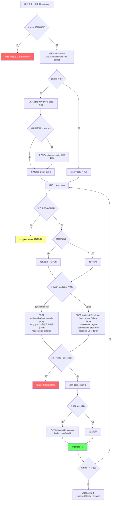

# 凭证导入流程图

```mermaid
flowchart TD
    A[用户点击「导入到 9router」] --> B{9router 是否在运行?}
    B -->|否| B1[报错: 请先启动本地 9router]
    B -->|是| C[派生 x-9r-cli-token<br/>sha256 machineId + cli-secret]

    C --> D{检测到代理?}
    D -->|是| E[GET /api/proxy-pools 查现有池]
    E --> F{找到匹配的 proxyUrl?}
    F -->|是| G[复用已有 proxyPoolId]
    F -->|否| H[POST /api/proxy-pools 创建新池]
    H --> G
    D -->|否| I[proxyPoolId = null]

    G --> J[遍历 creds/*.json]
    I --> J

    J --> K{文件是合法 JSON?}
    K -->|否| K1[skipped: JSON 解析失败]
    K -->|是| L{顶层是数组?}
    L -->|是| M[解包取第一个元素]
    L -->|否| N[原样使用]

    M --> O{有 token_endpoint 字段?}
    N --> O

    O -->|是 external_idp| P[POST /api/oauth/kiro/import-cli-proxy<br/>body: json = 原始文件内容字符串<br/>header: x-9r-cli-token]
    O -->|否 idc| Q[POST /api/oauth/kiro/import<br/>body: refreshToken, clientId,<br/>clientSecret, region, authMethod, profileArn<br/>header: x-9r-cli-token]

    P --> R{HTTP 200 + success?}
    Q --> R

    R -->|否| S[failed: 返回错误原因]
    R -->|是| T[拿到 connection.id]

    T --> U{有 proxyPoolId?}
    U -->|是| V[PUT /api/providers/connId<br/>body: proxyPoolId]
    U -->|否| W[跳过关联]

    V --> X[imported + 1]
    W --> X

    X --> Y{还有下一个文件?}
    Y -->|是| J
    Y -->|否| Z[返回汇总结果<br/>imported / failed / skipped]

    style S fill:#f66,color:#fff
    style X fill:#6f6,color:#000
    style K1 fill:#ff9,color:#000
    style B1 fill:#f66,color:#fff
```

